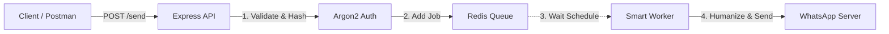

# 🚀 WA Gateway API (Scheduler & Queue Edition)


A high-performance, self-hosted WhatsApp Gateway API built with **Node.js**, **Baileys**, and **Redis**. Designed to handle high-throughput messaging with smart queuing, precise scheduling, and anti-ban heuristics.

## ✨ Key Features

* **⚡ Queue System:** Powered by **BullMQ & Redis** to handle bursts of traffic without crashing or blocking the main thread.
* **📅 Smart Scheduler:** Supports delayed messages using ISO 8601 timestamps (e.g., send message 1 hour from now).
* **🛡️ Anti-Ban Protection:** Implements "Humanization" logic (Random Jitter, Typing Presence) to minimize WhatsApp banning risks.
* **🔐 Strong Security:** API endpoints secured via **Argon2 Hashing** (no plain text passwords).
* **🐳 Dockerized:** Ready to deploy anywhere with `docker-compose`.
* **💾 Persistent Session:** WhatsApp Auth state is saved in Docker Volumes (no need to rescan QR on restart).

---

## 🛠️ Architecture


## ⚙️ Environment Variables

Copy `.env.example` to `.env`.

⚠️ **IMPORTANT:** Since we use Argon2, you must generate a hash for your API Secret. If using Docker, you MUST escape the `$` signs by doubling them (`$$`).
```bash
# Generate your hash locally:
npx argon2-cli "your-password"
# Output: $argon2id$v=19$m=65536....
```

Your `.env` file:
```env
NODE_ENV=production
PORT=3001
ALLOWED_ORIGIN=*

# SECURITY: Use $$ instead of $ for Docker Compose compatibility
API_SECRET_HASH=$$argon2id$$v=19$$m=65536$$...[YOUR_HASH_HERE]

# REDIS CONFIG
REDIS_HOST=localhost
REDIS_PORT=6379
REDIS_PASSWORD=your_redis_password
```

## 🚀 How to Run

### Option 1: Using Docker (Recommended)

The easiest way to run the service without installing Node.js locally.

1. **Create `docker-compose.yml`:**
```yaml
version: "3.8"
services:
  wa-gateway:
    image: ezdevv/wa-gateway:latest
    restart: unless-stopped
    ports:
      - "3001:3001"
    env_file: .env
    volumes:
      - ./auth_info_baileys:/app/auth_info_baileys
    depends_on:
      - redis

  redis:
    image: redis:alpine
    command: redis-server --requirepass your_redis_password
    ports:
      - "6379:6379"
```

2. **Start the Service:**
```bash
docker-compose up -d
```

3. **Scan QR Code:** Check the logs to see the QR Code.
```bash
docker logs -f wa-gateway-container-name
```

### Option 2: Manual Installation (Dev Mode)

1. **Install Dependencies:**
```bash
pnpm install
```

2. **Start Redis** (Make sure Redis is running locally).

3. **Run in Development Mode:**
```bash
pnpm dev
```

## 🔌 API Usage

### Send Message / Schedule Message

* **Endpoint:** `POST /send`
* **Headers:** `x-api-key: your-plain-password`

**Body Payload:**
```json
{
  "number": "6281234567890",
  "message": "Hello, this is a scheduled message!",
  
  // Optional: Remove this field to send instantly.
  // Format: ISO 8601 String
  "scheduleAt": "2026-01-29T15:00:00.000Z" 
}
```

**Tip:** To generate a schedule time for "5 minutes from now" in browser console:
```javascript
new Date(Date.now() + 5 * 60 * 1000).toISOString()
```

## ☁️ Deployment Notes

### Deploy on Railway

1. Provision a Redis service in Railway.
2. Deploy this repo as a service.
3. Set Environment Variables (`REDIS_HOST`, `API_SECRET_HASH`, etc).
4. **Crucial:** Add a Volume mount at `/app/auth_info_baileys`.
   * Without this, you will need to scan the QR code every time the server restarts.

## 📄 License

This project is open-source and available under the MIT License.

**Disclaimer:** This project is not affiliated with WhatsApp. Use responsibly and at your own risk.